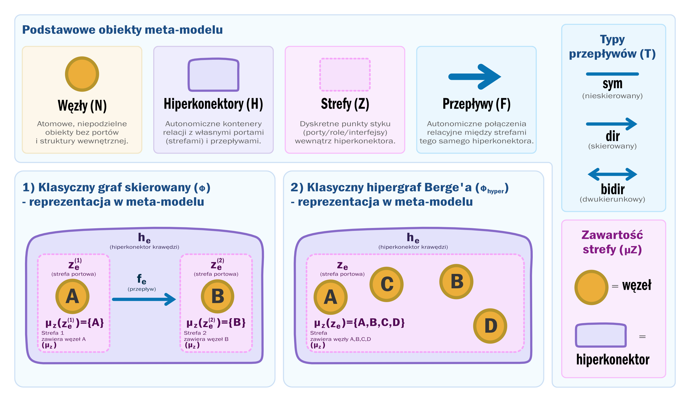

# Cisowski's Hyperconnector Model (Hiperkonektory Cisowskiego / Grafy Cisowskiego)

Wprowadzam koncepcje "Grafów Cisowskiego" - są nadrzędnym meta-modelem (nadzbiorem), klasyczne teorie grafów i hipergrafów to jedynie jego zubożone podstruktury.

1. Klasyczny graf skierowany $\Big(\Phi\Big)$

   - **Tradycyjne ujęcie:** Bezpośrednia relacja binarna $1:1$ łącząca dwa wierzchołki $\Big(u \to v\Big)$. Krawędź jest jedynie „płaskim” połączeniem pozbawionym własnej struktury wewnętrznej.

   - **Redukcja w Meta-Modelu:**  Hiperkonektor zredukowany do dwóch jednoelementowych stref portowych $\Big(z_e^{(1)}$ zawiera $u$, $z_e^{(2)}$ zawiera $v\Big)$ powiązanych pojedynczą instancją przepływu skierowanego $\Big(\pi_F(f_e) = (z_e^{(1)}, z_e^{(2)}, \mathrm{dir})\Big)$.

2. Klasyczny hipergraf Berge’a $\Big(\Phi_{\mathrm{hyper}}\Big)$

   - **Tradycyjne ujęcie:** Płaski podzbiór wierzchołków $\Big(e \subseteq V\Big)$. Wszystkie elementy w krawędzi są równorzędne — brak tam jakichkolwiek wyróżnionych ról, portów czy struktury wewnętrznej.

   - **Redukcja w Meta-Modelu:** Skrajnie uproszczony hiperkonektor całkowicie pozbawiony wewnętrznej dynamiki relacyjnej $\Big(\vert{}F_{h_e}\vert{} = 0\Big)$, posiadający zaledwie jedną strefę portową $\Big(z_e\Big)$, której funkcja zawartości przechowuje pełny zbiór wierzchołków $\Big(\mu_Z(z_e) = \Phi_{\mathrm{hyper}}(e)\Big)$.

3. Klasyczny skierowany hipergraf $\Big(\Phi_{\mathrm{dir\_hyper}}\Big)$

   - **Tradycyjne ujęcie:** Relacja wieloargumentowa łącząca podzbiór wejściowy (Tail) z podzbiorem wyjściowym (Head) w formule $T \to H$.

   - **Redukcja w Meta-Modelu:** Hiperkonektor posiadający dokładnie dwie strefy interfejsowe $\Big(z_e^{\mathrm{tail}}$ oraz $z_e^{\mathrm{head}}\Big)$, z których każda agreguje odpowiedni podzbiór wierzchołków, spięte jednym wewnętrznym przepływem skierowanym między tymi portami.

4. Metagrafy / Grafy hierarchiczne

   - **Tradycyjne ujęcie:** Umożliwiają łączenie całych podgrafów lub krawędzi z innymi krawędziami, jednak często cierpią na brak twardej izolacji (połączenia skrośne przeskakują poziomy zagnieżdżenia).

   - **Redukcja w Meta-Modelu:** Pełna, inżynieryjna enkapsulacja. Dowolna strefa może zawierać inne hiperkonektory $\Big(\mu_Z(z) \subseteq U\Big)$, tworząc ufundowaną strukturę zagnieżdżoną $\Big(\mathcal{R}_{\mathrm{contain}}\Big)$, w której jakikolwiek ruch skrośny jest ściśle kontrolowany przez dedykowane porty $\Big(Z_h\Big)$ i lokalne przepływy $\Big(F_h\Big)$.

## Słownik Ontologiczny

### ♦️ Węzły ($N$ – Nodes / Atoms)

- Podstawowe, niepodzielne obiekty lub jednostki danych, które nie posiadają żadnej struktury wewnętrznej ani portów.

- Atomy ontologiczne. Byty pozbawione wewnętrznej struktury topologicznej ($\vert{}Z_n\vert{}$ nie istnieje). Stanowią podstawowe jednostki danych lub obiekty niepodzielne w uniwersum.

### ♣️ Hiperkonektory / Hiperkrawędzie ($H$ – Hyperconnectors / Relational Complexes)

- Autonomiczne kontenery relacji, które posiadają własną tożsamość, własne porty (strefy) oraz wewnętrzne połączenia (przepływy).

- Autonomiczne byty relacyjne posiadające własną tożsamość oraz przypisaną strukturę wewnętrzną $(Z_h, F_h)$. Użycie terminu hiperkrawędź w niniejszym formalizmie ma charakter rozszerzający i należy je rozumieć w sensie hiperkonektora (kompleksu portowego). W przeciwieństwie do klasycznej hiperkrawędzi Berge’a (będącej jedynie płaskim podbiorem wierzchołków), $H$ definiuje lokalny kontekst topologiczny posiadający własne porty (strefy) oraz wewnętrzną dynamikę (przepływy).

### ♥️ Strefy ($Z$ – Zones / Ports)

- Dyskretne punkty styku wewnątrz hiperkonektora. Pełnią podwójną rolę: są portami dla wewnętrznych przepływów oraz kontenerami na obiekty ($N$ i $H$). Ten sam obiekt z uniwersum (zarówno węzeł, jak i inny zagnieżdżony hiperkonektor) może znajdować się w zawartości wielu stref naraz.

- Dyskretne elementy strukturalne stanowiące punkty styku (porty / role / interfejsy) danej hiperkrawędzi. Strefa $z \in Z_h$ nie jest zbiorem, lecz instancją portu o unikalnej tożsamości globalnej ($z_1 \neq z_2$). Pełni podwójną rolę: interfejsu relacyjnego (dla funkcji $\pi_F$) oraz kontenera zawartości (dla funkcji $\mu_Z(z) \subseteq U$). Zawartość stref ($\mu_Z$), obejmująca węzły $N$ oraz hiperkonektory $H$, może być współdzielona.

### ♠️ Przepływy ($F$ – Flows / Relational Instances)

- Autonomiczne połączenia relacyjne zachodzące wyłącznie pomiędzy strefami należącymi do tego samego hiperkonektora.

- Autonomiczne instancje relacji zachodzące wyłącznie pomiędzy strefami należącymi do tej samej hiperkrawędzi ($Z_h \times Z_h$). Przepływ $f \in F_h$ nie jest zbiorem par, lecz unikalnym obiektem wskazywanym przez funkcję przydziału $\pi_F$, niosącym atomowy typ orientacji $T = \{\mathrm{sym}, \mathrm{dir}, \mathrm{bidir}\}$.

## Aksjomaty Systemu

### ♦️ Aksjomat 1 (Ontologia Węzłów)

- W systemie istnieją węzły ($N$), które są prostymi, niepodzielnymi elementami (atomami) bez portów czy struktury wewnętrznej.

- Istnieje zbiór węzłów $N$, których elementy są ontologicznymi atomami pozbawionymi struktury portowej.

### ♣️ Aksjomat 2 (Ontologia Hiperkonektorów)

- W systemie istnieją hiperkonektory ($H$), które są całkowicie odrębne od węzłów ($N$). Razem z węzłami tworzą pełne uniwersum obiektów ($U$).

- Istnieje zbiór hiperkonektorów $H$. Zbiory $N$ oraz $H$ są rozłączne i tworzą uniwersum obiektów:
   $U = N \sqcup H \quad \mathrm{gdzie} \quad N \cap H = \emptyset$ .

### ♥️ Aksjomat 3 (Lokalność i Rozłączność Stref)

- Każdy hiperkonektor ma swój własny, unikalny zestaw stref (portów). Jedna strefa nie może należeć do dwóch hiperkonektorów naraz.

- Każdemu hiperkonektorowi $h \in H$ przypisana jest lokalna rodzina stref $Z_h$. Strefy należące do różnych hiperkonektorów są ściśle rozłączne:
   $\forall h_1, h_2 \in H \quad (h_1 \neq h_2 \implies Z_{h_1} \cap Z_{h_2} = \emptyset)$ .

### ♥️ Aksjomat 4 (Globalne Uniwersum Stref)

- Wszystkie strefy w całym systemie tworzą łączną przestrzeń $Z$. Strefa nie może istnieć „luzem” poza swoim hiperkonektorem.

- Globalną przestrzeń stref $Z$ definiuje się jako sumę rozłączną rodzin lokalnych:
   $$Z = \bigsqcup_{h \in H} Z_h$$
   Strefy nie istnieją jako samodzielne byty poza swoim hiperkonektorem macierzystym.

### ♠️ Aksjomat 5 (Lokalność i Rozłączność Przepływów)

- Przepływy są w 100% lokalne – dany przepływ należy ściśle do swojego hiperkonektora i nie może bezpośrednio wychodzić poza niego.

- Każdemu hiperkonektorowi $h \in H$ przypisana jest lokalna rodzina instancji przepływów $F_h$. Przepływy należące do różnych hiperkonektorów są ściśle rozłączne:
   $$\forall h_1, h_2 \in H \quad (h_1 \neq h_2 \implies F_{h_1} \cap F_{h_2} = \emptyset)$$

### ♠️ Aksjomat 6 (Globalne Uniwersum Przepływów)

- Cała przestrzeń przepływów w systemie ($F$) składa się wyłącznie z połączeń zdefiniowanych w poszczególnych hiperkonektorach.

- Globalną przestrzeń przepływów $F$ definiuje się jako sumę rozłączną rodzin lokalnych:
   $$F = \bigsqcup_{h \in H} F_h$$
   Przepływy nie istnieją jako samodzielne byty poza swoim hiperkonektorem macierzystym.

### ♣️ Aksjomat 7 (Odwzorowanie Struktury Hiperkonektora)

- Każdy hiperkonektor ma przypisaną strukturę złożoną ze stref i przepływów. Może posiadać zero stref (byt bezportowy) lub zero przepływów.

- Struktura dowolnego hiperkonektora $h \in H$ jest określona przez funkcję przydziału:
   $$\sigma: H \to \mathcal{P}(Z) \times \mathcal{P}(F) \quad \mathrm{gdzie} \quad \sigma(h) = (Z_h, F_h)$$
   Dopuszczalne są liczności $\vert{}Z_h\vert{} \ge 0$ oraz $\vert{}F_h\vert{} \ge 0$. Stan $\vert{}Z_h\vert{} = 0$ definiuje byt bezportowy (placeholder).

### ♥️ Aksjomat 8 (Zawartość Stref i Współdzielenie Zawartości)

- Strefa może być pusta lub zawierać w sobie dowolne węzły ($N$) oraz zagnieżdżone hiperkonektory ($H$). Ten sam obiekt z uniwersum $U$ (dowolny węzeł lub inny hiperkonektor) może znajdować się jednocześnie w zawartości wielu różnych stref..

- Zawartość każdej strefy $z \in Z$ opisuje funkcja:
   $$\mu_Z: Z \to \mathcal{P}(U)$$
   Strefa może być pusta ($\mu_Z(z) = \emptyset$) lub zawierać dowolny podzbiór węzłów $N$ i/lub hiperkonektorów $H$. Obrazy funkcji $\mu_Z$ dla różnych stref nie muszą być rozłączne — dozwolone jest współdzielenie obiektów z uniwersum $U = N \sqcup H$ przez odrębne strefy.

### ♥️ Aksjomat 9 (Relacja Zagnieżdżenia i Aksjomat Ufundowania)

- Hiperkonektory mogą zawierać w swoich strefach inne hiperkonektory, tworząc strukturę zagnieżdżoną. Zagnieżdżanie nie może jednak tworzyć cykli (samozawierania) ani nieskończonej głębokości.

- Relację bezpośredniego zagnieżdżenia $\mathcal{R}_{\mathrm{contain}} \subseteq U \times U$ definiuje się jako:
   $$(h, u) \in \mathcal{R}_{\mathrm{contain}} \iff h \in H \land \exists z \in Z_h \bigl(u \in \mu_Z(z)\bigr)$$
   Relacja $\mathcal{R}_{\mathrm{contain}}$ jest dobrze ufundowana (well-founded), co wyklucza istnienie nieskończonych łańcuchów zagnieżdżenia $u_0 \ni u_1 \ni u_2 \dots$. Ponadto jej domknięcie przechodnie $\mathcal{R}_{\mathrm{contain}}^+$ jest ściśle irrefleksywne:
   $$\forall u \in U \quad (u, u) \notin \mathcal{R}_{\mathrm{contain}}^+$$

### ♠️ Aksjomat 10 (Instancja i Typowanie Przepływu)

- Każdy przepływ wewnątrz hiperkonektora łączy dwie jego strefy i posiada jeden z trzech typów połączenia: nieskierowane (—), skierowane (⟶) lub dwukierunkowe (⟷).

- Każda instancja przepływu $f \in F_h$ jest odwzorowywana przez funkcję przydziału:
   $$\pi_F: F_h \to Z_h \times Z_h \times T \quad \mathrm{gdzie} \quad T = \{\mathrm{sym}, \mathrm{dir}, \mathrm{bidir}\}$$

### ♠️ Aksjomat 11 (Symetria Reprezentacji i Auto-Przepływy)

- Przy połączeniu nieskierowanym (—) lub dwukierunkowym (⟷) kolejność podania stref nie ma znaczenia. Mimo tej samej symetrii portowej, (—) oznacza powiązanie statyczne (np. styk), a (⟷) aktywny kanał dwukierunkowy (f⟷). Przepływ może również łączyć strefę z samą sobą (auto-przepływ).

- Dla typów orientacji $t \in \{\mathrm{sym}, \mathrm{bidir}\}$ zachodzi symetria reprezentacji krotki modulo relacja równoważności $\equiv$:
   $$(z_1, z_2, t) \equiv (z_2, z_1, t)$$
   Dla $t = \mathrm{dir}$ kolejność argumentów w parze jest asymetryczna. Dozwolone są auto-przepływy, gdzie $z_1 = z_2$.

> ℹ️ Uwaga dotycząca semantyki typów: Relacja $\equiv$ określa wyłącznie symetrię podłączenia do portów $Z_h \times Z_h$. Typy sym i bidir stanowią jednak rozłączne elementy zbioru $T$: typ sym reprezentuje statyczną relację nieskierowaną (np. styk/potencjał), natomiast bidir reprezentuje atomowy, aktywny kanał dwukierunkowy ($f_{\leftrightarrow}$), którego pełna dwustronna dynamika jest interpretowana w Warstwie Semantycznej ($\mathcal{S}$).

### ♠️ Aksjomat 12 (Multigrafowość Warstwy Relacyjnej)

- Między tymi samymi dwiema strefami w tym samym hiperkonektorze może istnieć wiele niezależnych, równoległych przepływów tego samego typu.

- Funkcja $\pi_F$ nie musi być iniekcją. Dwa odrębne obiekty przepływu $f_1, f_2 \in F_h$ ($f_1 \neq f_2$) mogą posiadać identyczny obraz $\pi_F(f_1) = \pi_F(f_2)$, co tworzy strukturę multigrafu.

## Definicje Zanurzenia

### 📖 Definicja Kanonicznego Zanurzenia Iniekcyjnego ($\Phi$) (Klasycznej Krawędzi w Grafie)

- Klasyczna krawędź grafu (np. $A \to B$) jest po prostu szczególnym przypadkiem hiperkonektora, który posiada dwie odrębne strefy (zawierające odpowiednio $A$ i $B$) oraz jeden przepływ skierowany między nimi.

- Dowolny klasyczny graf skierowany $G = (V, E)$, gdzie $E \subseteq V \times V$, jest reprezentowalny w meta-modelu poprzez kanoniczne zanurzenie iniekcyjne:
   
   $$\Phi: V \sqcup E \hookrightarrow U, \quad \mathrm{gdzie} \quad \Phi(V) \subseteq N \quad \mathrm{oraz} \quad \Phi(E) \subseteq H$$
   
   Dla każdej krawędzi $e = (u, v) \in E$ niech $h_e = \Phi(e) \in H$. Hiperkonektor $h_e$ posiada strukturę $\sigma(h_e) = (\{z_e^{(1)}, z_e^{(2)}\}, \{f_e\})$, gdzie $z_e^{(1)} \neq z_e^{(2)}$, i spełnia warunki:
   
   $$\mu_Z(z_e^{(1)}) = \{\Phi(u)\}, \quad \mu_Z(z_e^{(2)}) = \{\Phi(v)\}, \quad \pi_F(f_e) = (z_e^{(1)}, z_e^{(2)}, \mathrm{dir})$$

### 📖 Definicja Zanurzenia Klasycznej Hiperkrawędzi ($\Phi_{\mathrm{hyper}}$)

- Klasyczna nieskierowana hiperkrawędź Berge’a (worek/zbiór wierzchołków) jest po prostu szczególnym przypadkiem hiperkonektora, który posiada jedną strefę (zawierającą ten zbiór wierzchołków) oraz brak jakichkolwiek wewnętrznych przepływów.

- Dowolny klasyczny hipergraf Berge’a $\mathcal{H} = (V, E)$, gdzie $e \subseteq V$ dla każdego $e \in E$, jest reprezentowalny w meta-modelu poprzez kanoniczne zanurzenie iniekcyjne:
   
   $$\Phi_{\mathrm{hyper}}: V \sqcup E \hookrightarrow U, \quad \mathrm{gdzie} \quad \Phi_{\mathrm{hyper}}(V) \subseteq N \quad \mathrm{oraz} \quad \Phi_{\mathrm{hyper}}(E) \subseteq H$$
   
   Dla każdej hiperkrawędzi $e \in E$ niech $h_e = \Phi_{\mathrm{hyper}}(e) \in H$. Hiperkonektor $h_e$ posiada strukturę $\sigma(h_e) = (\{z_e\}, \emptyset)$ (brak przepływów, $\vert{}F_{h_e}\vert{} = 0$) i spełnia warunek:
   
   $$\mu_Z(z_e) = \{\Phi_{\mathrm{hyper}}(v) \mid v \in e\}$$

### 📖 Definicja Zanurzenia Klasycznej Skierowanej Hiperkrawędzi ($\Phi_{\mathrm{dir\_hyper}}$)

- Klasyczna skierowana hiperkrawędź (łącząca zbiór wejściowy ze zbiorem wyjściowym) jest szczególnym przypadkiem hiperkonektora, który posiada dwie odrębne strefy (zawierające odpowiednio wierzchołki źródłowe i docelowe) oraz jeden przepływ skierowany między tymi strefami.

- Dowolny klasyczny skierowany hipergraf $\mathcal{H}_{\mathrm{dir}} = (V, E_{\mathrm{dir}})$, gdzie każda krawędź jest parą zbiorów $e = (T_e, H_e)$ dla $T_e, H_e \subseteq V$ (zbiór wejściowy Tail i wyjściowy Head), jest reprezentowalny w meta-modelu poprzez kanoniczne zanurzenie iniekcyjne:
   
   $$\Phi_{\mathrm{dir\_hyper}}: V \sqcup E_{\mathrm{dir}} \hookrightarrow U, \quad \mathrm{gdzie} \quad \Phi_{\mathrm{dir\_hyper}}(V) \subseteq N \quad \mathrm{oraz} \quad \Phi_{\mathrm{dir\_hyper}}(E_{\mathrm{dir}}) \subseteq H$$
   
   Dla każdej skierowanej hiperkrawędzi $e = (T_e, H_e) \in E_{\mathrm{dir}}$ niech $h_e = \Phi_{\mathrm{dir\_hyper}}(e) \in H$. Hiperkonektor $h_e$ posiada strukturę $\sigma(h_e) = (\{z_e^{\mathrm{tail}}, z_e^{\mathrm{head}}\}, \{f_e\})$, gdzie $z_e^{\mathrm{tail}} \neq z_e^{\mathrm{head}}$, i spełnia warunki:
   
   $$\mu_Z(z_e^{\mathrm{tail}}) = \{\Phi_{\mathrm{dir\_hyper}}(v) \mid v \in T_e\}, \quad \mu_Z(z_e^{\mathrm{head}}) = \{\Phi_{\mathrm{dir\_hyper}}(v) \mid v \in H_e\}$$
   
   $$\pi_F(f_e) = (z_e^{\mathrm{tail}}, z_e^{\mathrm{head}}, \mathrm{dir})$$

---
---
